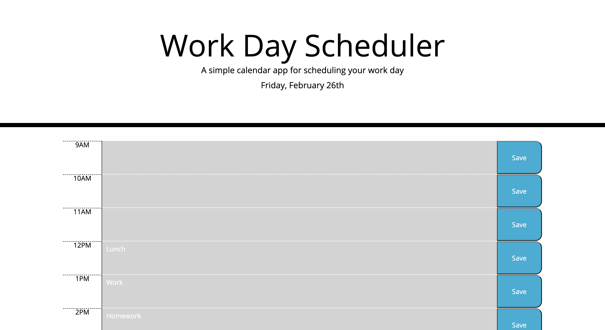
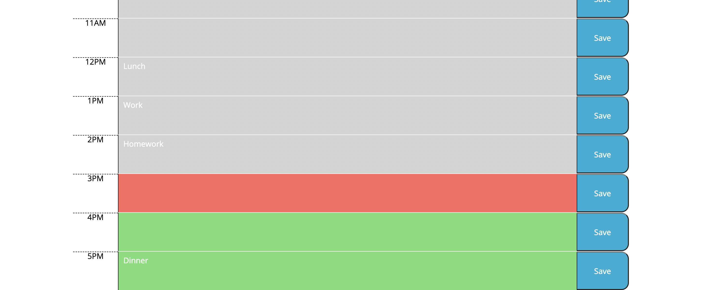

# Work Day Scheduler

## Table of Contents
[Project Link](#Link)  
[Technologies](#Technologies)  
[Description](#Description)  
[Screenshots](#Screenshots)  
[License](#License)  
[Contact](#Contact)

## Link
https://dalto135.github.io/work-day-scheduler/

## Technologies
HTML, CSS and Javascript

## Description
A daily planner that displays today's date and a layout of today's work hours. The user can input text into each hour block and click save, saving the input even when the page is refreshed.

## Screenshots

## License
MIT

## Contact
Dalton Wilkins - wilkins.271@osu.edu
